#README

### 项目说明
该项目帮助需求方财务结算。结算该公司旗下每个店的收益，成本情况，员工工资发放情况，扣除情况。扣除工资通过员工上传.xls导入数据库去匹配。最后将每个月的成本明细，员工工资明细，签单明细，过户明细等以表格，可视化的形式供给高层领导分析，制定计划。
### 项目部署
1. git clone 到本地
2. cd /financial_management/code
3. cp .env.example .env
4. php artisan key:generate  生成laravel key
5. 打开.env配置数据库的相关信息
6. composer install 安装laravel相关打依赖
7. npm(cnpm, yarm) install 安装前端依赖
8. chmod -R storage 755 and chmod -R bootstrap 755
9. cd ../db 找到最新的数据库导入本地数据库
10. php artisan serve 调试

### 项目截图
* 登录界面			

* 首页			
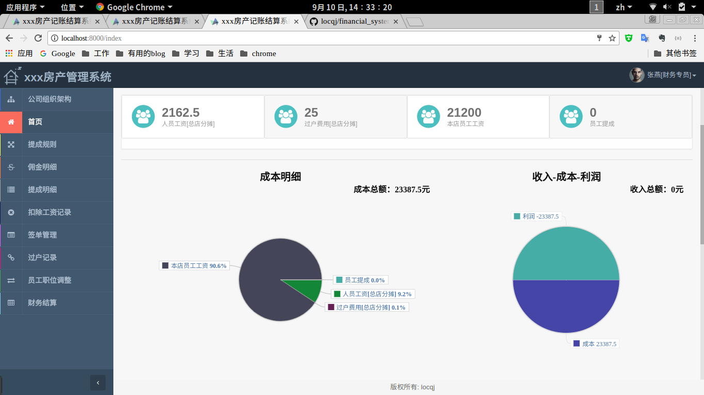
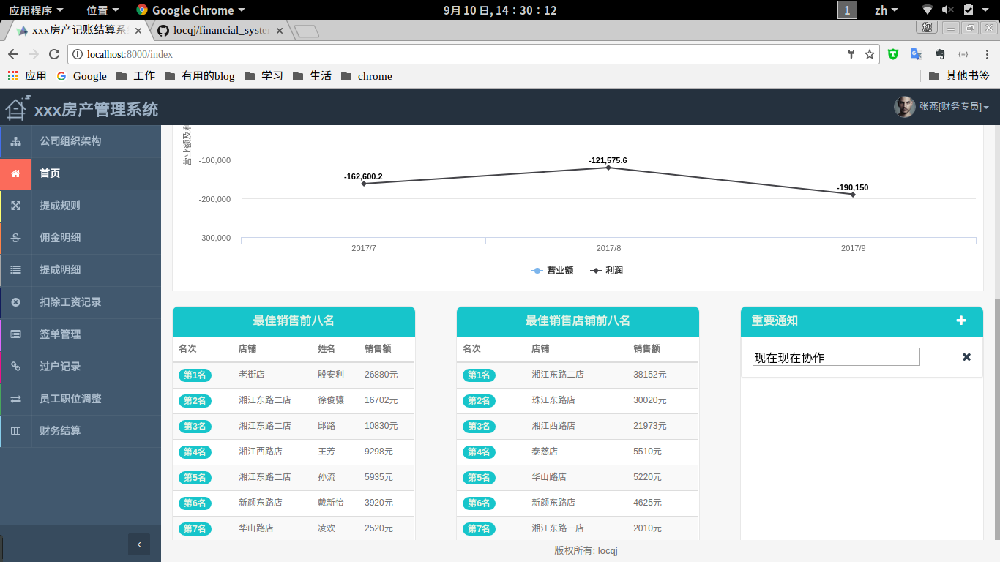
* 公司组织结构	
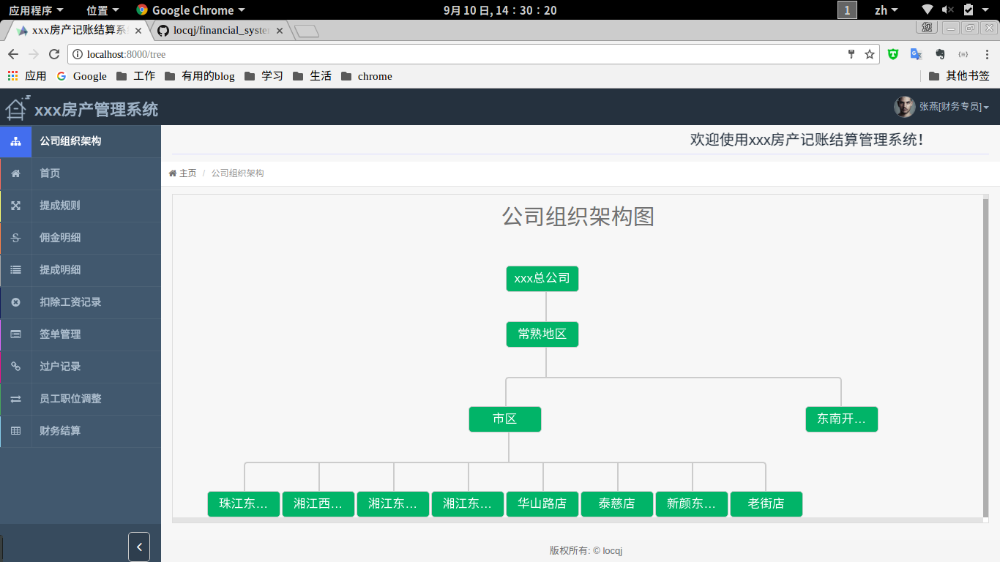
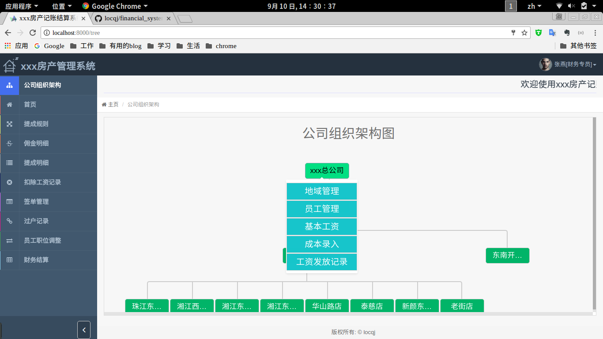
* 签单管理		
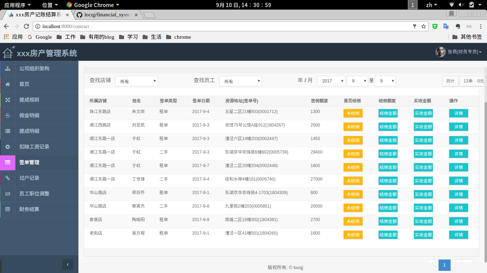
* 规则设置			
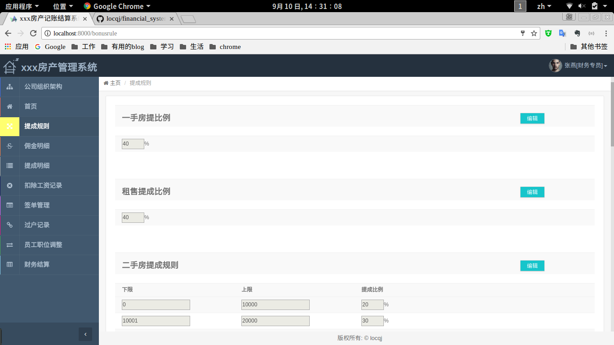
* 职位管理		
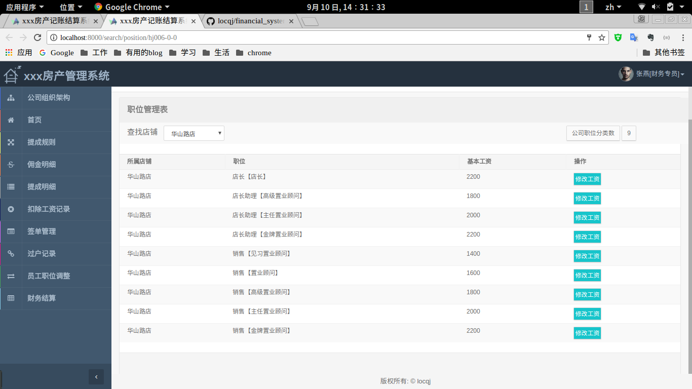
* 店铺管理			
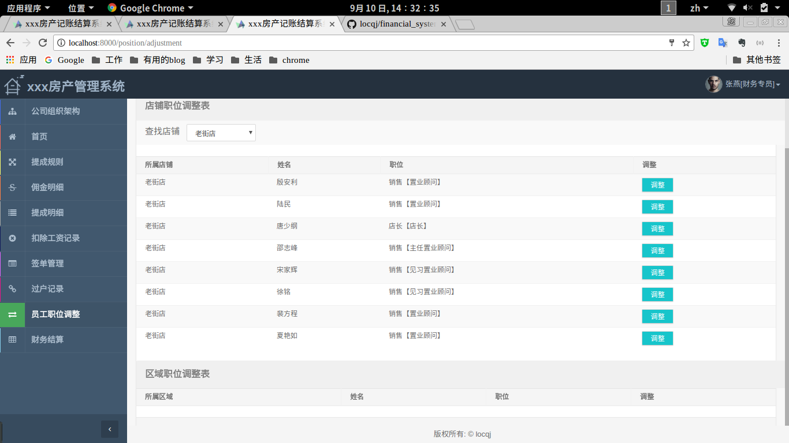
* 工资发放记录		
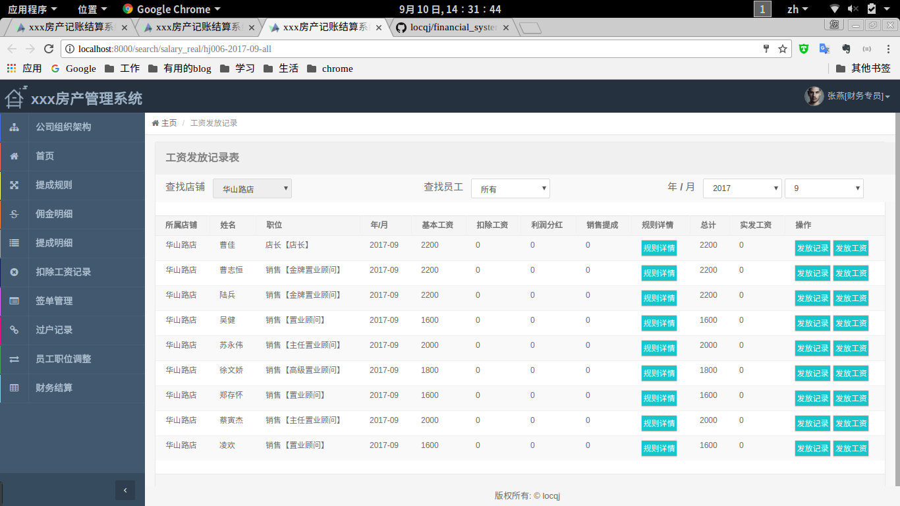
* 店铺管理，区域管理等		
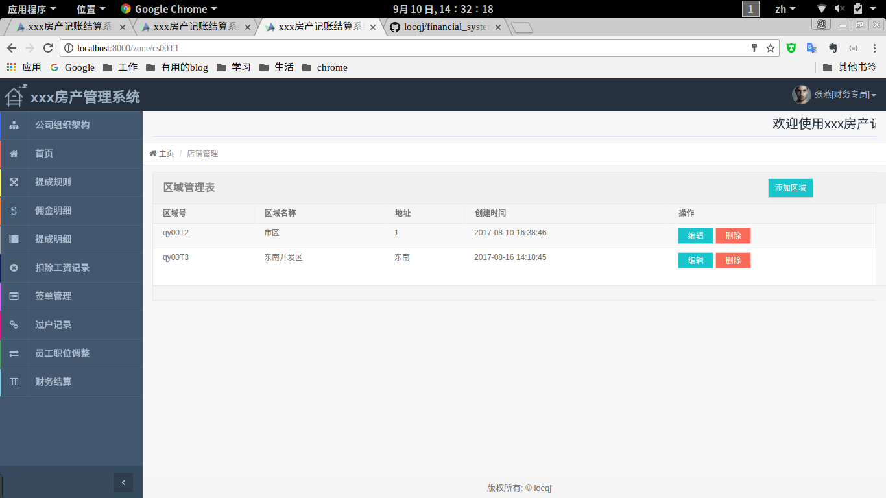
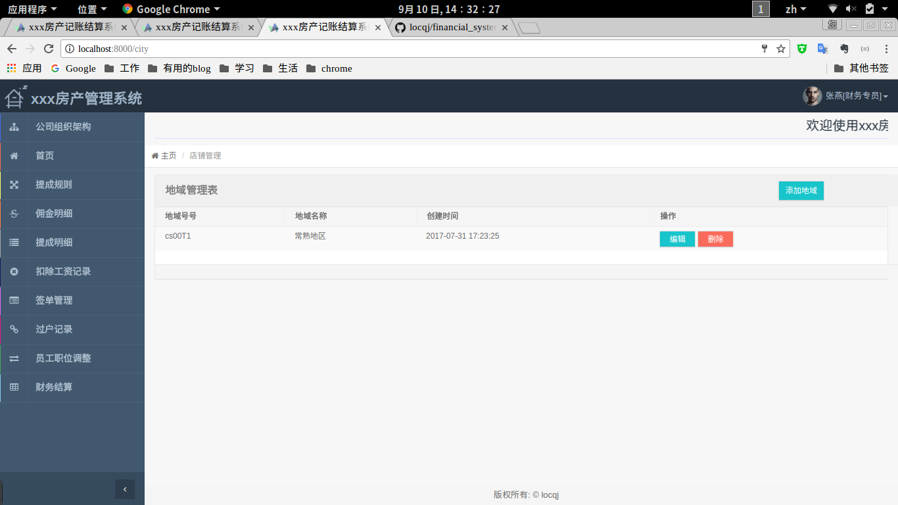
* 财务核算			
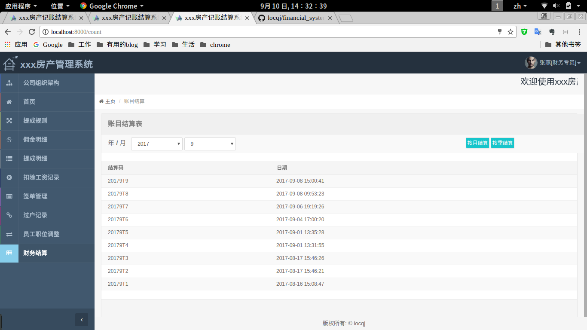

### 项目核心
该项目核心在核算的时间点选择，这边我设计数据库将一个update_code作为时间点计算，将相应需要成本计算的数据提取出来，然后遍历求得每家分店，和总公司的盈利亏损情况
### 代码目录结构

#### 后台

绝对路径是/home/wwwroot/default/hengju/financial_management/code/app/ (服务器)

``` 
├── User.php
├── StoreZone.php
├── StoreStore.php
├── StoreIncome.php
├── StoreCost.php
├── StoreCompany.php
├── StoreCity.php
├── StaffTransferRecord.php
├── StaffPosition.php
├── StaffPositionLevel.php
├── StaffPort.php
├── StaffEmployee.php
├── StaffContract.php
├── StaffBonusRule.php
├── SalaryReduce.php
├── SalaryDetails.php
├── PositionAdjustmentLog.php
├── CommissionDetails.php
├── CalculateStore.php
├── CalculateLog.php
├── BonusDetails.php 以上为model层，和数据库名相对应，例如StoreZone 对应数据库store_zone
├── Http
│   ├── routes.php
│   ├── Requests
│   │   └── Request.php
│   ├── Middleware 中间件，做身份限制，和登陆验证的配置地方
│   │   ├── VerifyCsrfToken.php
│   │   ├── RedirectIfAuthenticated.php
│   │   ├── EncryptCookies.php
│   │   ├── DZorCWMiddleWare.php 店长和财务职能有重复的中间件
│   │   ├── DZMiddleWare.php 店长中间件
│   │   ├── CWMiddleWare.php 财务中间件
│   │   ├── ChackLogin.php 验证登陆中间件
│   │   ├── cAuthentication.php 身份验证中间件
│   │   └── Authenticate.php
│   ├── Kernel.php
│   └── Controllers 控制器
│       ├── UserController.php 密码修改
│       ├── TreeController.php 组织结构
│       ├── StoreZoneController.php 区域管理
│       ├── StoreStoreController.php 店铺管理
│       ├── StoreIncomeController.php 店铺收入
│       ├── StoreCostDetailsController.php 店铺成本明细
│       ├── StoreCostController.php 店铺成本（录入）
│       ├── StoreCompanyController.php 公司（暂时没用）
│       ├── StoreCityController.php 城市（暂时没用）
│       ├── StaffTransferRecordController.php 过户记录
│       ├── StaffPositionController.php 职位管理
│       ├── StaffPortController.php 端口管理
│       ├── StaffEmployeeController.php 员工管理
│       ├── StaffController.php 集成一部分店铺搜索， 区域搜索，删除的功能（还有一部分是姜巡写的）
│       ├── StaffContractController.php 签单管理
│       ├── StaffBonusRuleController.php 提成规则
│       ├── SalaryReduceController.php 扣除工资
│       ├── SalaryRealController.php 实收工资
│       ├── SalaryDetailsController.php 基本工资明细
│       ├── LoginController.php 登陆，退出相关
│       ├── KeyFindController.php 另一部分店铺搜索， 区域搜索
│       ├── IndexController.php 首页（图表的展示，最高销售等等）
│       ├── CountController.php 财务核算
│       ├── Controller.php 基类控制器，有一些公用的函数方法都写在这一块
│       ├── CommissionDetailsController.php 佣单明细
│       ├── CalculateController.php 核心计算部分
│       ├── BonusDetailsController.php 提成明细       
└──	├── AutoPositionAdjController.php 根据季度自动调整职位（要跟所有验证独立开来，定时任务服务器已经配置好，脚本路径为/home/hengju.sh）

```

#### 前台
绝对路径是/home/wwwroot/default/hengju/financial_management/code/resources/views (服务器)


```
 views
    ├── contract
    │   └── contract.blade.php 签单管理页面
    ├── count
    │   └── count.blade.php 财务总核算页面
    ├── details
    │   ├── bonus_details.blade.php 提成明细页面
    │   └── commission_details.blade.php 佣金明细页面
    ├── employee
    │   ├── employee_list.blade.php 员工管理页面（分店和总店）
    │   ├── employee_qy_list.blade.php 员工管理页面（区域）
    ├── index
    │   └── index.blade.php 首页
    ├── job
    │   ├── job_adjustment.blade.php 职位调整
    │   ├── job_management.blade.php 职位管理
    │   ├── salary_details.blade.php 基本工资明细
    │   ├── salary_real.blade.php 实收工资
    │   └── salary_reduce.blade.php 扣除工资
    ├── layouts 公共模块（有问题看文档的layouts）
    │   ├── app.blade.php
    │   └── nav.blade.php
    ├── login 
    │   └── index.blade.php 登陆页面
    ├── port 
    │   ├── port.blade.php 端口管理
    ├── store
    │   ├── cost.blade.php 成本录入
    │   ├── income.blade.php 店铺收入
    │   ├── store.blade.php 店铺管理
    │   ├── store_cost_detail.blade.php 店铺成本明细
    │   └── zone.blade.php 区域管理
    ├── transfer
    │   └── transfer_record.blade.php 过户规则
    ├── tree
    │   └── tree.blade.php 组织结构
    └── 

```


#### 资源

绝对路径 /home/wwwroot/default/hengju/financial_management/code/public

```

├── index.php 系统入口文件
├── robots.txt
├── static 静态资源文件
│   ├── css 
│   │   ├── hengju.css
│   │   ├── index2.css
│   │   ├── index.css
│   │   ├── logn1.css
│   │   └── logn.css
│   ├── fonts
│   │   ├── fontawesome-webfont.eot
│   │   ├── fontawesome-webfont.svg
│   │   ├── fontawesome-webfont.ttf
│   │   └── fontawesome-webfont.woff
│   ├── images
│   │   ├── 1.png
│   │   ├── 3.jpg
│   │   ├── cost.gif
│   │   ├── employee_management.gif
│   │   ├── fclogo.png
│   │   ├── logn.png
│   │   ├── logo.png
│   │   ├── position.gif
│   │   ├── store.gif
│   │   └── user.jpg
│   └── js
│       └── employee_information.js
└── web.config

```

#### 系统配置文件在
绝对路径 /home/wwwroot/default/hengju/financial_management/code/ 下面的.env文件，该文件在仓库是忽略上传的，所以拉下来打时候只要在同级目录下面cp .env.example .env就好

### 核心功能说明

#### 自动职位调整
我是用linux自带的crontab来实现。

* crontab -e 编辑定时任务
* crontab -l 查看定时任务
* /etc/init.d/cron/crontab {start|status|restart|stop} 相应服务操作
/crontab/locqj/159753

### 导入数据
目前在SalaryReduce中用到，可直接调用
模版下载放在public/download目录中


### 计算方面
大前提就是，将收入按照月为单位去结算，先生成统一的update_code,然后获取每个月最新打update_code(主要是用作数据匹配的作用)，去计算店铺打成本，员工的工资利润等。按季度结算实际就是将按月结算循环执行三遍。
### 其他
在financial_management目录下面有两个脚本，便于测试数据，和清空数据

* inserDB.sh 是模拟测试数据的添加
* delectDB.sh 是删除数据初始化
* 这两个脚本针对的系统版本是7-29前，后如果迭代开发了，适当修改脚本，以免初始数据误删除
* 在db文件夹下面放的是系统迭代过程打数据库， dosc是相应的文本
* public目录下backupMysql下backup_mysql.sh 是备份数据库的脚本，可根据服务器环境mysql以及项目目录所在的位置调整
* db中有数据库重大更新的各个版本，以最后一个版本为准，最好取带init关键字的
* public下upload和static/file需要写权限
* 总公司默认三个员工
财务为code：hj001T2。端口减去工资reducer用到权限

	

	tic/file需要写权限
* 总公司默认三个员工
财务为code：hj001T2。端口减去工资reducer用到权限

	

	
	为code：hj001T2。端口减去工资reducer用到权限

	

	
	